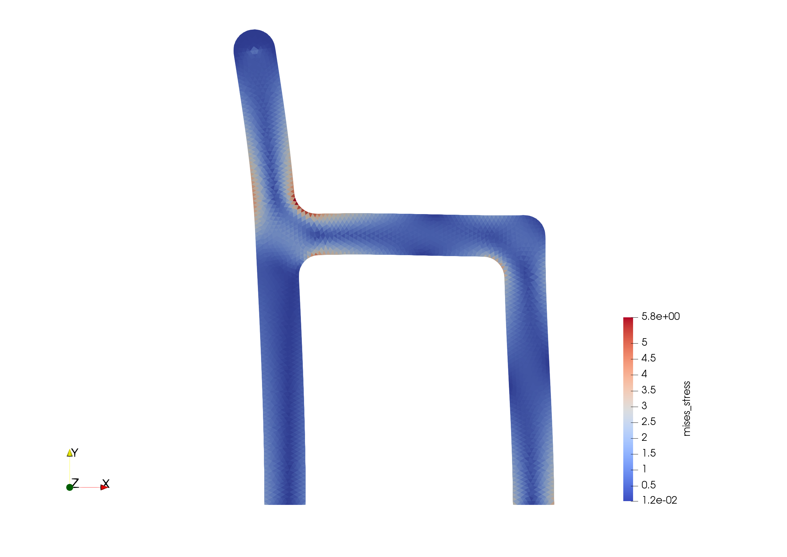

# minimalFEM-VTK

1ファイルに収まる簡易的なFEMコード．
このコードは[MinimalFEM](https://github.com/podgorskiy/MinimalFEM/)([Tutorial](http://podgorskiy.com/spblog/304/writing-a-fem-solver-in-less-the-180-lines-of-code))を参考にして作りました． 

# usage

1 コンパイル
```
g++ -I vendor minimalfem.cpp
```

2 インプット・アウトプットファイルを指定して実行
```
./a.out input/test1.inp output/test1.vtk
```

3 [paraview](https://www.paraview.org/)で結果が見れます.

exmple test3

